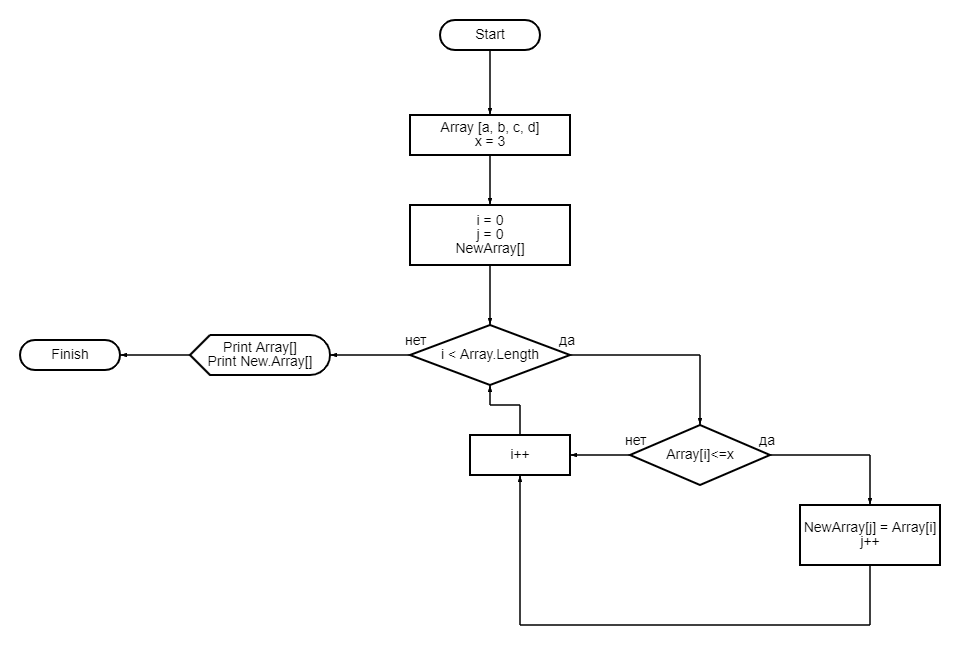

# Итоговый проект 1 четверти
## Задача
**Дано:** *Написать программу, которая из имеющегося массива строк формирует новый массив из строк, длина которых меньше, либо равна 3 символам. Первоначальный массив можно ввести с клавиатуры, либо задать на старте выполнения алгоритма. При решении не рекомендуется пользоваться коллекциями, лучше обойтись исключительно массивами
пример: [“Hello”, “2”, “world”, “:-)”] → [“2”, “:-)”].*
*****
**Решение:**
1. Массив строк задается на старте программы
2. Затем циклом for подсчитываем сколько раз выполняется условие строка меньше или равно 3 символам и полученное значение присваиваем  переменной j.
3. Создаем новый массив размером j.
4. Циклом for находим значения удовлетворяющие условию и заносим их в новый созданный массив.
5. Методом Print выводим на экран значения обоих массивов.
Блок схема решения представлена ниже

